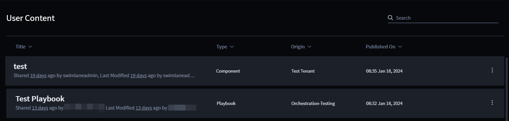

User Content
============

+--------------+--------------------------+--------------------------+
| Term         | Definition               | Characteristics          |
+==============+==========================+==========================+
|              | A repository for content | -  Makes user-created    |
|              | packages that may        |    content packages      |
| User Content | contain playbooks and    |    available to multiple |
|              | their dependencies that  |    users across the      |
|              | has been published to    |    tenants               |
|              | the content library.     | -  Easy-to-read content  |
|              |                          |    data such as, type,   |
|              |                          |    origin, and published |
|              |                          |    date and time         |
+--------------+--------------------------+--------------------------+

 

User Content lists all the playbooks and their dependencies that are
published from any Tenant on your account. You can easily share content
between the Tenants on your account.

To access playbooks, follow these steps:

#. Log in to **Turbine**.

#. From the left-hand navigation pane, click **LIBRARY** and click
   **User Content**.

The homepage displays. The following data about the content is
available:

-  Title

-  Type (Component or Playbook)

-  Origin (Originating tenant)

-  Published On (the date and time the content was published)

|image1|

Use the ellipsis icon to **Delete** or **Deploy** the content.

See `Publish Playbook <../orchestration/canvas-playbooks.rst#Publish>`__
and `Publish
Components <../orchestration/canvas-components.rst#Publish>`__ for
details on how to publish either from their respective canvas's and
homepages.

