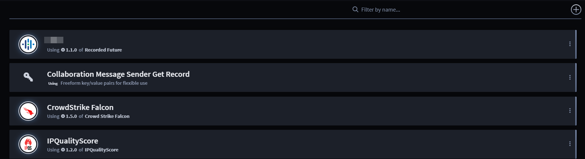
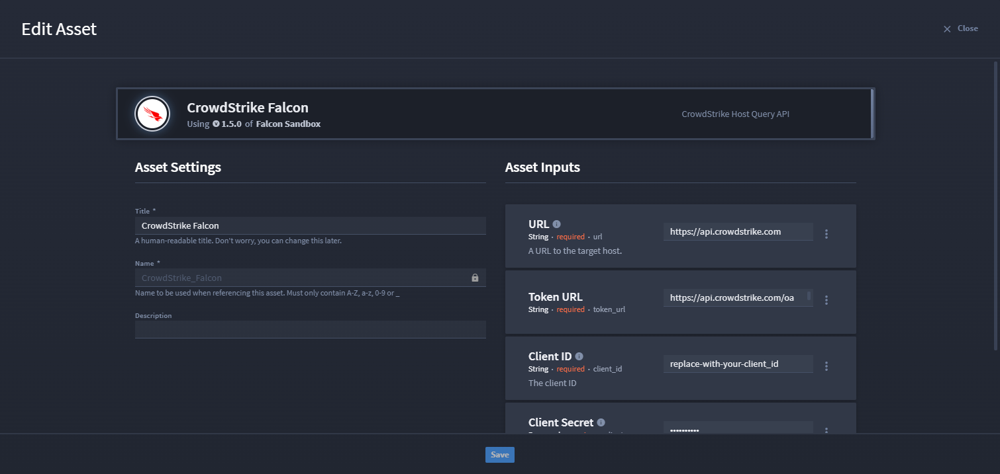
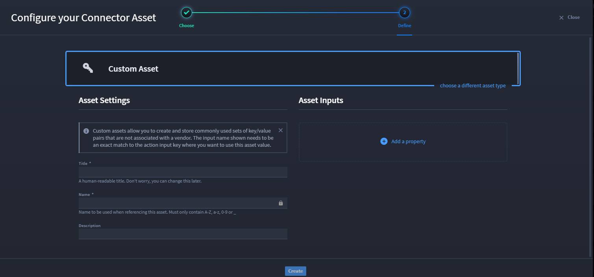
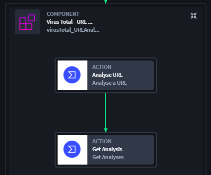

Assets
======

+--------+-----------------------------+-----------------------------+
| Term   | Definition                  | Characteristics             |
+========+=============================+=============================+
|        |                             | -  Can be for a specific    |
|        |                             |    connector or customized, |
| Assets | Saved credentials and       |    which can be applied to  |
|        | key/value pairs that help   |    any action inputs.       |
|        | you connect to              |                             |
|        | technologies, and also      | -  Most useful for          |
|        | serve as a key store for    |    standardizing and        |
|        | commonly used sets of keys  |    securing configurations. |
|        | and values                  |                             |
+--------+-----------------------------+-----------------------------+

Assets can be for a specific connector or customized, which can be
applied to any action inputs and are assets are most useful for
standardizing and securing configurations. In Turbine Canvas, assets can
be configured in your playbook allowing you to configure a connector and
its asset without leaving the playbook canvas.

Homepage
--------

To access assets, follow these steps:

#. Log in to **Turbine**.

#. From the left-hand navigation pane, click **ORCHESTRATION** and click
   **Assets**.

|image1|

From the Assets homepage, a list of existing assets show automatically
sorted alphabetically. You can use the features listed in the table to
navigate the assets homepage for a faster and easier experience.

+----------------+----------------------------------------------------+
| Feature        | Function                                           |
+================+====================================================+
| Filter by name | Use to filter by asset name                        |
+----------------+----------------------------------------------------+
| Plus icon      | Select an asset type and view connector details    |
|                | (if applicable)                                    |
+----------------+----------------------------------------------------+
| Ellipsis icon  | Click to edit an asset from the homepage or delete |
|                | an asset                                           |
+----------------+----------------------------------------------------+

If you want to edit an asset from the homepage:

#. Click the **ellipsis** icon and select **Edit** **asset**.

The Edit Asset window opens. From here, modify the asset as needed and
then save.

|image2|

Create Asset from Homepage
--------------------------

If you do not see an existing asset on the homepage, you can create a
custom asset.

**Tip**: A custom Asset has a key icon. Details on creating custom
assets are further in this section. Keep scrolling!

#. Click the **plus** icon to open the Configure your Connector Asset
   window.

#. In the Title and Name fields, enter a **title** and **name**. These
   fields are required.

#. Click **Add a property** to select the **property type** to
   configure.

|image3|

After you click Create, the custom asset is now available from the
Assets homepage.

Configure Assets in Canvas
~~~~~~~~~~~~~~~~~~~~~~~~~~

Want to apply an asset without mapping to your playbook inputs
manually? Watch as we apply the existing Virus Total (VT) asset to
connectors inside a component. Let's use the same VirusTotal connectors
from the `Components <canvas-components.rst>`__ page example. The
following image shows the expanded Virus Total - URL Analysis component.
Inside are two VT connectors that need to have the VT asset applied.
Open in the component builder.

|image4|

To apply the asset:

#. Click on the individual action to enable the Action panel details on
   the right-hand side of the canvas.

#. Expand the **Asset** section.

#. In the drop-down menu, select **VirusTotal** asset.

#. Repeat for the next VT action.

Now your asset is applied to the action. If you wish to modify the data,
simply click the Configure hyperlink and modified the action inputs,
outputs, or test manually.

Custom Assets
-------------

To access playbooks, follow these steps:

#. Log in to **Turbine**.

#. From the left-hand navigation pane, click **ORCHESTRATION** and click
   **Assets**.

#. Click the **plus** icon to open the Select an Asset Type window.

The first available asset is the Custom Asset, where you can map static
data and product-specific values that can be referenced across multiple
playbooks and multiple actions.

|image5|

After you click Create, the next configuration step automatically opens
where you can set up the title and name for your asset and add any
properties as asset inputs to apply to actions in your playbook. The
following example shows that we have created a custom asset using a
string property to create a Google endpoint.

 

**Important!** The input name shown needs to be an exact match to the
action input key where you want to use this asset value.

 

|image6|

Once you've configured, click **Create** and the custom asset is now
available from the Asset homepage. A unique identifier is knowing that
all of your custom assets will have a |image7| icon.

Continue to the next section for Connector homepage information.

.. |image5| image:: ../../Resources/Images/canvas-custom-asset.png
.. |image6| image:: ../../Resources/Images/canvas-custom-asset-config.png
.. |image7| image:: ../../Resources/Images/canvas-key-icon.png
