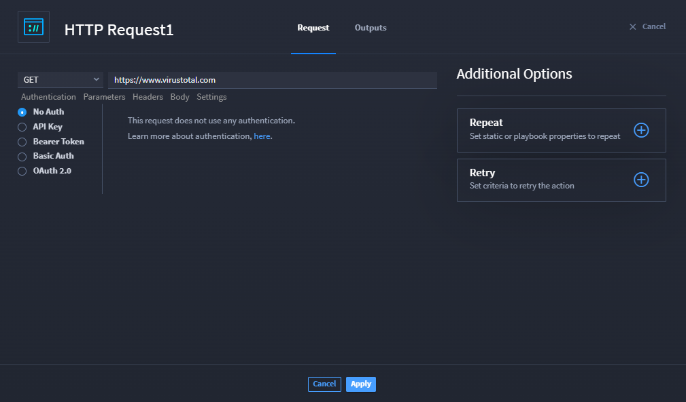
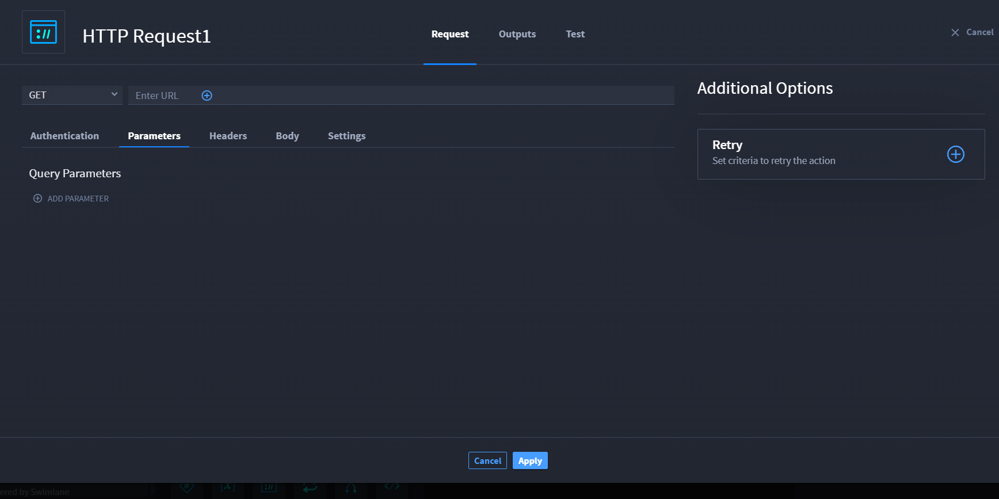
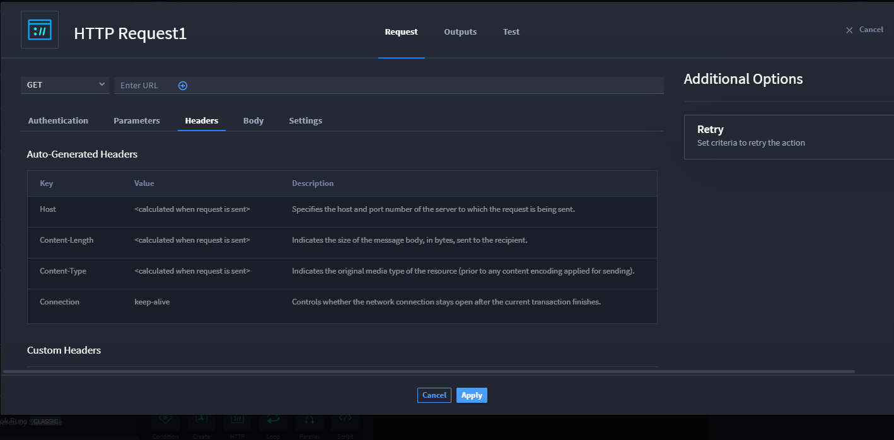
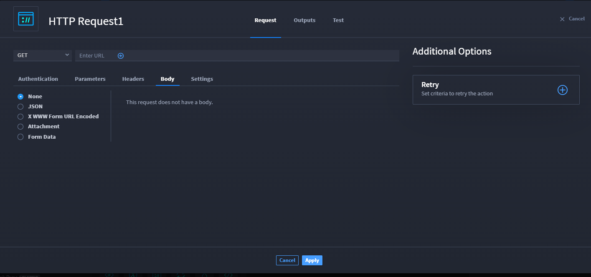

HTTP Request
============

Turbine allows you to use the native HTTP Request action to get data
from/send data to a particular API endpoint, regardless of whether a
connector exists for the API service. This allows you to build a more
comprehensive playbook with better performance and outputs.

Capabilities
------------

Configure the authentication type, parameters, and body from the native
actions

Add the Action
--------------

To configure the HTTP request, from the Add panel, drag and drop the
**HTTP Request** action and click **Configure**.

Read the following sections for information about the HTTP Request
configuration tabs.

Request Method
--------------

In the request method drop-down, select the request method.

**Note:** GET is the default request method.

Here are the available methods:

+------------+--------------------------------------------------------+
| **Method** | **Information**                                        |
+============+========================================================+
| GET        | Retrieve data                                          |
+------------+--------------------------------------------------------+
| POST       | Get, add, or modify data                               |
+------------+--------------------------------------------------------+
| PUT        | Add or replace data                                    |
+------------+--------------------------------------------------------+
| PATCH      | Partially update existing data                         |
+------------+--------------------------------------------------------+
| DELETE     | Delete existing data                                   |
+------------+--------------------------------------------------------+
| OPTIONS    | Request information about the actions available for    |
|            | interacting with the target resource                   |
+------------+--------------------------------------------------------+
| HEAD       | Retrieve response headers                              |
+------------+--------------------------------------------------------+
| TRACE      | Perform a message loopback test on the path to the     |
|            | target resource                                        |
+------------+--------------------------------------------------------+

|image1|

Authentication Tab
------------------

This tab contains the HTTP authentication types.

============ =========================================
**Type**     **Information**
============ =========================================
No Auth      Does not require any authentication.
API Key      Requires key, value, and location.
Bearer Token Requires a security token.
Basic Auth   Requires a username and password.
OAuth 2.0    Requirements are based on the OAuth flow.
============ =========================================

|image2|

**Note:** Updates to the request occur at run-time.

Parameters Tab
--------------

This tab allows you to add query parameters to the request.

To add a query parameter:

#. Click **ADD PARAMETER**, and then enter key-value pairs.
   |image3|

Headers Tab
-----------

This tab is largely informational. The **Auto-Generated Headers** table
shows a list of the common request headers that will be automatically
generated and added to the request at run-time.\ |image4|

The **Custom Headers** table allows you to add any headers that are
needed by the API endpoint, a proxy, etc. You can also use this table to
override any of the auto-generated headers (e.g., Content-Type).

Body Tab
--------

This tab allows you to specify the data to send in the request body. You
will need to select the body type that the API Service is expecting.

Options include: **None**, **JSON**, **X WWW FORM URL Encoded**,
**Attachment**, and **Form Data**. Most of the time you will select
**None** or **JSON**. The default option is **None**.

**Warning!** When using the **Attachment** body type, if you click
**Select an attachment** and select playbook property that is composed
of an array of files, only the first file in the array will be sent in
the request.

**Tip:** If you need to send a specific file from a playbook property
that is comprised of a list of files, use an expression to reference the
files individually (e.g. **$inputs.files_to_scan[0]**).

|image5|

Settings Tab
------------

This tab is where you can configure a proxy and other request settings
like SSL/TLS certificate verification. To configure a proxy, select the
**Proxy** drop-down and select either **Create New Asset** to create a
new proxy asset or an existing asset from the list. To disable SSL/TLS
certificate verification, click **Enable SSL certificate verification**
to toggle off the setting.\ |image6|

Outputs Tab
-----------

Outputs tab allows you to select all outputs provided by the action and
you can promote them. The output tab also allows you to mark the data as
sensitive.

You can promote the action output by clicking **Promote** button next to
the action type from the **Action Outputs** list. The promoted output
action is displayed in the **Promoted Playbook Outputs** section.

You can remove the promoted output by clicking the **Remove** button
next to the promoted output.

Use Cases
---------

See `HTTP Request use
case <../use-cases/native-action-use-cases/http-requests.rst>`__ for
examples.

.. |image1| image:: ../../Resources/Images/http-request-methods.png

.. |image6| image:: ../../Resources/Images/http-settings-tab.png
