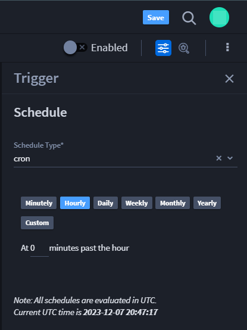
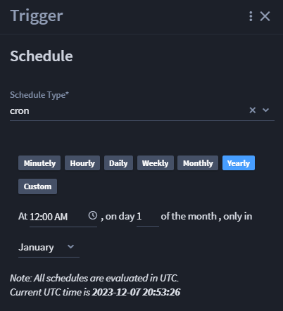

Schedule Triggers
=================

Schedule triggers initiate a playbook at the configured schedule. It's
best to use schedule triggers to automate repetitive tasks to enhance
productivity and decrease human errors. For example, you can use a
schedule trigger to help generate reports and avoid manually retrieving
data. This page shows you how to create a schedule trigger.

 

**Tip**: Scheduled playbooks (cron triggers) are evaluated in UTC.

**Note:** You do not need to select a trigger before adding and
configuring actions and/or components.

 

When you're ready to set a cron job for your playbook, follow these
steps:

#. In a playbook, from the Add panel, click and drag **Schedule** to the
   canvas.

Hover over the plus icon to add it to the canvas. The Trigger panel
displays to the right of the canvas. From here, you configure your
webhook trigger.

|image1|

#. Fill the following fields based on descriptions.

**Example**

The schedule trigger example has a yearly cron job occurring at 12:00AM
on January 1st each year.

#. Once the trigger options display, select **Schedule**.

To the right, the TRIGGER window displays with the **Trigger Type** as
*Schedule* and **Schedule Type** as *cron*.

#. Select the desired list of schedule times from: **Minutely**,
   **Hourly**, **Daily**, **Weekly**, **Monthly**, **Yearly**,
   **Custom**.

#. Depending on the selected schedule, a field displays below for you to
   configure the schedule.

   **Minutely:** Every **\_\_** minute.

   **Hourly:** At **\_\_** minutes past the hour.

   **Daily:** At **HH:MM AM/PM**

   **Weekly:** At **HH:MM AM/PM**, only on **day of the week** values
   list

   **Monthly:** At **HH:MM AM/PM**, only on **date of month** values
   list

   **Yearly:** At **HH:MM AM/PM**, only on **date of month** values
   list, only in **month**

   **Custom:** Enter the desired date/time in cron format

**Tip:** You can also use the up/down arrow icons to select the
numerical date of the month.

**Note:** Coordinated Universal Time (UTC) is used for all schedules.

| |image2|

5. When you are finished, click **Save**.

You have successfully created a schedule trigger!

