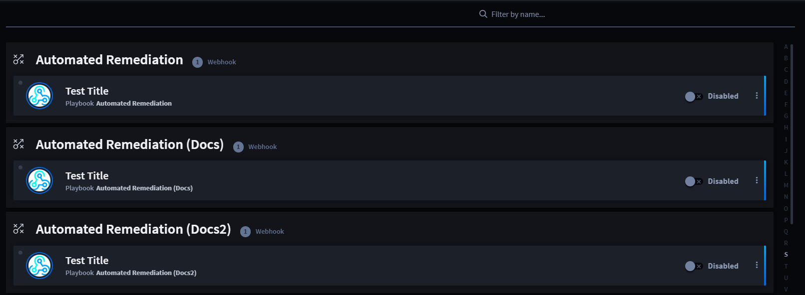

Webhooks
========

+----------+------------------------------------+--------------------+
| Term     | Definition                         | Characteristics    |
+==========+====================================+====================+
|          |                                    | Current triggers:  |
|          |                                    |                    |
| Triggers | A trigger initiates playbook       | -  **Webhook**     |
|          | processes. While a playbook can    |                    |
|          | only have one trigger per flow, it | -  Schedule        |
|          | can have more than one trigger     |                    |
|          | and/or trigger type. Turbine       | -  Record Event    |
|          | currently uses several types of    |                    |
|          | triggers to retrieve and/or ingest | -  Playbook Button |
|          | data.                              |                    |
+----------+------------------------------------+--------------------+

Webhooks are a type of event stream that enables products, vendors, or
services to push real-time communication in Turbine. They process and
enrich data to send from third-party services and platforms to Turbine
records.

Homepage
--------

To access playbooks, follow these steps:

#. Log in to **Turbine**.

#. From the left-hand navigation pane, click **ORCHESTRATION** and click
   **Webhooks**.

|image1|

From the Webhooks homepage, a list of available (disabled or enabled)
webhooks show automatically sorted alphabetically and by playbook. If a
playbook has more than one webhook, all of the webhooks will display
under the playbook's name. You can use the features listed in the table
to navigate the webhooks homepage for a faster and easier experience.

================ =======================================================
Feature          Function
================ =======================================================
Filter by name   Use to filter by webhook name
Disabled/Enabled Toggle between the disabled (default) or enabled status
Ellipsis icon    Click to edit the webhook in the canvas
================ =======================================================

 

See `Webhook Trigger <canvas-webhook-triggers.rst>`__ for specific
webhook information.

