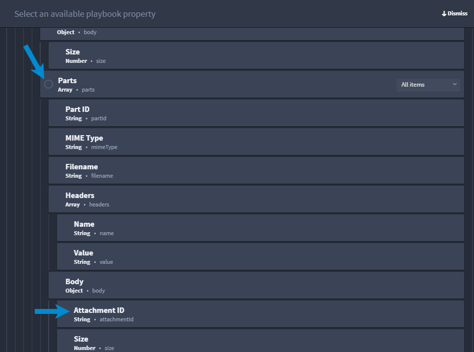

Get Attachment IDs as a File Use Case
=====================================

.. _scenario-get-gmail-email-ids-and-attachment-use-case:

Scenario
--------

Alex is an analyst who has already set up her Gmail account so that her
playbook retrieves a list of emails. Alex now wants to enhance the
playbook to retrieve attachment IDs as a file.

First
-----

First, Alex repeats steps 1-4 from `Get GMail Emails
List <get-gmail-emails-list-use-case.rst>`__\ . To accomplish getting
email attachments in a file, Alex needs to use a series of Google
connector actions. However, for best practices, Alex is going to use the
Turbine Loop native action to ensure data iterates to receive an array
of items, iterate through that array performing action(s) on each item,
and reduce the need for configuring a repeated nested playbook action to
apply more than one action to each item in an array.

Let's Dive In
-------------

After completing steps 1-4 from `Get GMail Emails
List <get-gmail-emails-list-use-case.rst>`__, Alex follows these steps:

#. Select an **On Success** action flow, and then add the **Loop**
   native action.

Alex titles the loop: **Iterate over emails**.

#. From the ACTION panel, click **Select property or expression** and
   select **Playbook property.**

Alex clicks the Get List Emails action and selects the Messages
property. Doing this ensures the ID array sub-property will be passed
downstream in the playbook.

|image1|

#. Next, add the **GMail - Get Email by ID** action.

#. From Available Assets, select **Google_Workspace** to apply required
   credentials.

#. Under Action Inputs, enter the User ID.

#. In the User ID field, enter the same user ID that you entered in the
   **GMail - List Emails** connector.

#. Click **select a property** and click **Playbook property**.

From the playbook properties, click the Iterate Over Emails Loop. From
the list of properties, Alex selects the ID string property. Once she
does, the dynamic value displays in the ID field under Action Inputs.
Alex clicks Apply to save changes.

|image2|

Alex is ready to add another Loop native action, so she repeats Step 1.
Alex titles the loop: **Get Attachments**.

#. From the ACTION panel, click **Select property or expression** and
   select **Playbook property.**

From the playbook properties, click the Get Email by ID action. In this
case, Alex must select the Parts array property to get the Attachment ID
property. There is now a nested loop in this playbook. 

|image3|

Only a few steps remaining!

#. Add an action and select **GMail - Get Email Attachment** and click
   **Configure.**

#. Add your **User ID** again.

#. Add the **Google_Workspace** asset again.

#. In Message ID, click **select a property** and click **Playbook
   property**.

#. In Attachment ID, click **select a property** and click **Playbook
   property**.

From the playbook properties, click the Get Email Attachment action. In
this case, Alex selects the Attachment ID string property.

|image4|

Alex clicks Apply to save her changes.

Conclusion
----------

Alex successfully used Turbine's Google Workspace connector, Google
Authentication assets, and Loop native actions to automate a playbook to
get attachment IDs as a file.

.. |image1| image:: ../../Resources/Images/get-attachments-in-file-use-case-1.png
.. |image2| image:: ../../Resources/Images/get-attachments-in-file-use-case-2.png

.. |image4| image:: ../../Resources/Images/get-attachments-in-file-use-case-4.png
