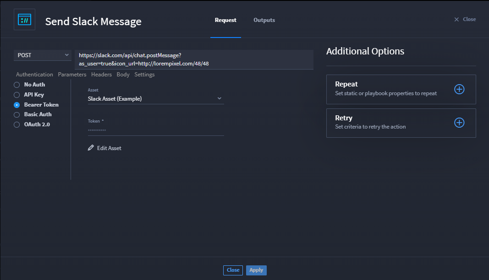
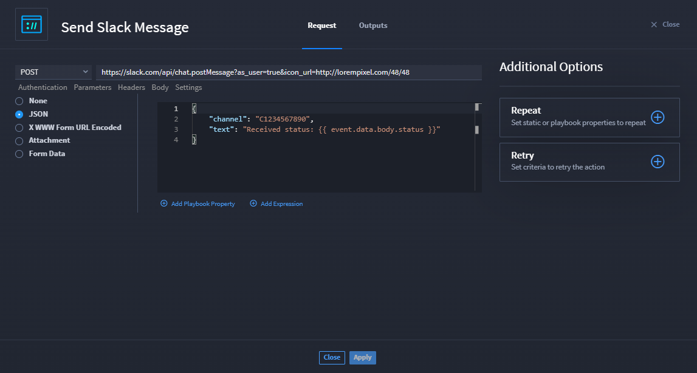

HTTP Requests
=============

Use HTTP Request native actions to get data from/send data to an API
endpoint, regardless of whether the connector exists for the API
service.

Max is a Turbine Admin, and he needs to send an HTTP request to a
third-party web service. Depending on the need, his options change.
Let's review the different options and requests that Max can use with
the customizable HTTP Request action.

**Note:** For the following examples, Max uses the two most common
request methods: GET and POST.

Scenario: Get Users from a Slack
--------------------------------

Max wants to verify a list of slack users using the Slack API. After
creating his playbook, he selects the **HTTP Request** action.

Time to set up a GET HTTP request.

#. Select **No authorization**.

#. Enter the URL https://api.slack.com/methods/users.list.

Conclusion
----------

And since Max is simply retrieving data from an API endpoint, no further
configuration is necessary.

Scenario: VirusTotal Scan to Get a File
---------------------------------------

Max wants to use the VirusTotal API to scan a file from an
**Attachments** playbook input. In this case, Max must use an expression
to retrieve an individual file from the attachments array and send the
file using a Form Data body type. Max configures the action using the
steps below:

#. From the HTTP Request action configuration window, select *POST* from
   the request method drop-down.

#. On the **Authentication** tab, select the **API Key** radio button.

#. On the **Parameters** tab, enter the key-value pairs.

#. On the **Form Data** tab:

   a. In **Key**, enter the name of the field expected by the API (In
      this case, VirusTotal requires **file**).

   b. Click the **Value** field and click **Expression**.

   c. In the **Enter an Expression** dialog, enter
      **$inputs.files_to_scan[0]**.

#. On the Settings tab, **Enable SSL certificate verification** toggle
   defaults on.

#. Click **Apply**.

.. _conclusion-1:

Conclusion
----------

Max has configured the HTTP action to submit a specific file from an
**Attachments** playbook input to VirusTotal to be scanned.

Scenario: Send a Slack Message
------------------------------

Max wants to send a Slack message using the HTTP Request action. The API
requires a Bearer authentication token, so Max uses an existing Slack
Asset that has been configured with the token. The service also requires
a POST request to submit the message to be sent in Slack. To set this
up, Max completes the following steps:

#. From the HTTP Request action configuration window, select *POST* from
   the request method drop-down.

#. | On the **Authentication** tab, select the **Bearer Token** radio
     button.
   | |image1|

3. On the **Parameters** tab, enter the key-value pairs.
   |image2|

No customized headers are needed, so Max moves on to the Body tab.

4. On the **Body** tab, select the **JSON** radio button.
   |image3|

5. Click **Apply**.

.. _conclusion-2:

Conclusion
----------

Now, Max's HTTP action will send the text message to the specified Slack
channel.

.. |image2| image:: ../../Resources/Images/http-use-case-send-slack-2.png

