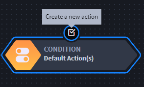

Create and Update Workflow
==========================

Before you begin creating workflow, you should have a clear idea of the
process you want to design. This includes understanding the many
conditions and workflow actions you have available to you.

As you build your workflow, you'll create branches of conditions and
workflow actions.

======== ==================================================
Icon     Definition
======== ==================================================
|image1| Creates a new condition
|image2| Creates a new workflow action
|image3| Disables the branch, condition, or workflow action
|image4| Deletes the branch, condition, or workflow action
======== ==================================================

To create or update workflow:

#. Open an applet or application, then select the Workflow icon from the
   toolbar.
   |image5|

2. The application's workflow opens with a default start icon, which can
   be followed by multiple conditions, including the default condition,
   **Default Action.
   **

3. To add a new condition, select the START icon (the root of the
   workflow) and then click the icon for *Create a new condition.
   *

Next you will begin to define the decision points of the workflow from
the condition you just created.

4. On Condition, provide a name and then indicate the field(s) from the
   applet or application that are part of the process you are designing.
   |image6|

5. Click **Add additional condition** to add more than one condition to
   the flow.

6. Click **Save** to save the condition.

7. Select the condition you just created and then click the icon to
   *Create a new action.*

   |image7|

8. On Action, name the workflow action, then select the action type.

9. Click **Save**.

.. |image1| image:: ../Resources/Images/wf-condition.png
.. |image2| image:: ../Resources/Images/wf-action.png

.. |image5| image:: ../Resources/Images/workflowicon.png
.. |image6| image:: ../Resources/Images/wf-define-condition.png

