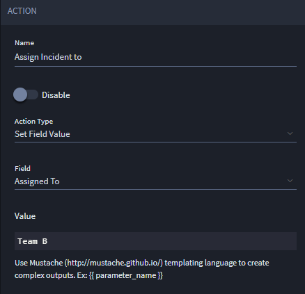
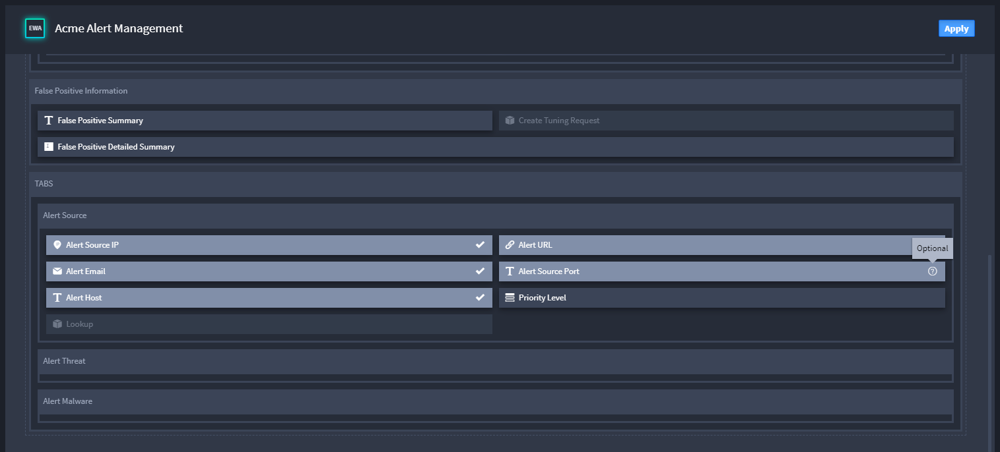
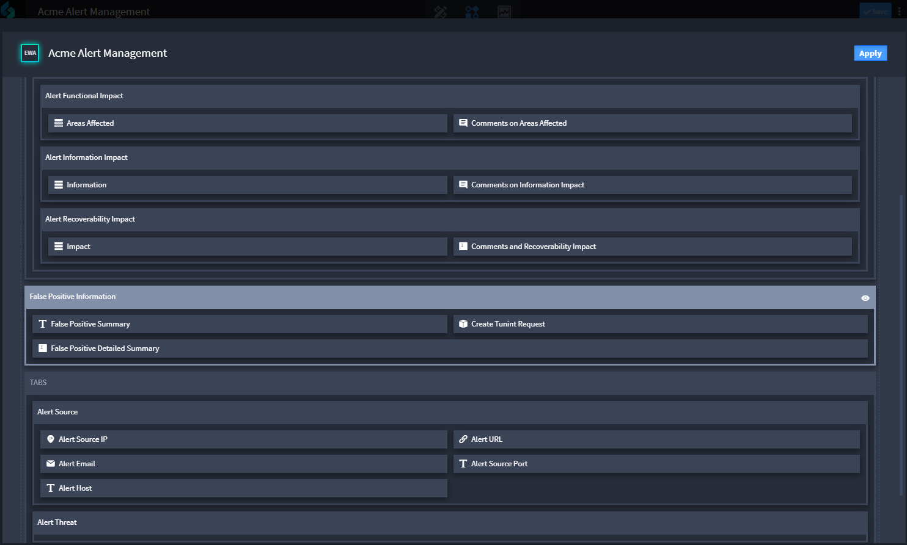

Select Workflow Action Type
===========================

Review this topic to learn more about the different workflow action
types.

Set Field Value
---------------

This workflow action updates a field value.

|image1|

The value for the field you select changes according to the inputs
available for the field. For example, if you select a date or time
field, then your values will be relative to dates and times. If you
decide to use a selection field, you will see the defined incident types
as multiple values as in the example above.

Set Field Read or Write
-----------------------

Use this workflow action to set a field as read-only or as an editable
field.

|image2|

Click **Select Fields** to open a window with a view of the fields in
the application. Click a field to set it to Hide, or read-only status.
Click it again to set it to an editable status. You can see the existing
status of the field by hovering over the field. A lock icon indicates
read-only status; a pencil icon indicates an editable status.

Set Field Required or Optional
------------------------------

Use this workflow action to specify whether a field is required or
optional.

|image3|

Click **Select Fields** to open a window with a view of the fields in
the application. Click a field to set it to required status. Click it
again to set it to an optional status. You can see the existing status
of the field by hovering over the field, or by the checkmark or question
mark icon on the field upon update.

Filter Selection Options
------------------------

Use this workflow action to specify the values to update on a field that
has multiple values available.

|image4|

Modify Layout
-------------

Use this workflow action to specify whether a field displays in the
record.

|image5|

Click **Select Layout Items** to open a window that displays the fields
available in the application. Click a field to have a field exposed to
view, or hidden from view. You can use this action on sections, tabs,
and html elements. For sections and tabs you can view, hide, expand, and
collapse.

.. |image2| image:: ../../Resources/Images/fieldreadwritesettings.png

.. |image4| image:: ../../Resources/Images/filtervaluelist.png

