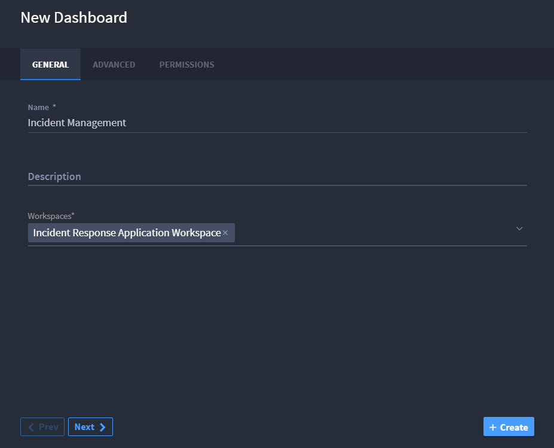

Creating a Dashboard as an Administrator
----------------------------------------

As an administrator, you can create new dashboards.

To create a dashboard as an administrator:

#. Under WORKSPACE MANAGEMENT, select Dashboards, then from the
   Dashboards taskbar, select **+ New Dashboard**.
   |image1|

2. On New Dashboard, enter the name, description, and associated
   workspaces.
   |image2|

3. Click the ADVANCED tab. To indicate whether you want the dashboard to
   record a timeline, enable or disable the timeline switch.
   |image3|

4. Click the PERMISSIONS tab. Specify whether the dashboard is a
   personal dashboard or specify other role-based permissions.
   |image4|

5. Click **+ Create** to create your dashboard. A dialog box appears
   that verifies that your dashboard has been successfully created.
   |image5|

.. |image1| image:: ../Resources/Images/new-dashboard-workspace-management.png

.. |image3| image:: ../Resources/Images/dashboard-advanced.png
.. |image4| image:: ../Resources/Images/personal-dashboard.png
.. |image5| image:: ../Resources/Images/dashboard-confirmation.png
